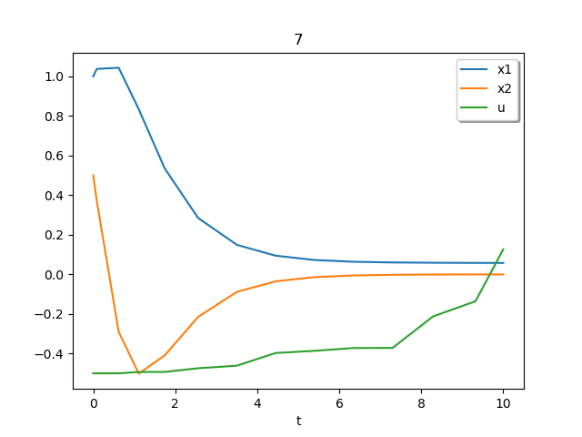

# 1
## Given
$$
\begin{array}{l}
    \dot{x}_1 = -x_1^3 + x_2 \\
    \dot{x}_2 = x_1 - x_2^3
\end{array}
$$

## Find
* Determine the equilibria for the given system
* Determine their qualitative nature (saddle, node, etc)
* Plot the vector field

## Solution
Begin by finding equilibrium points $x_{eq}$ (See appendix for worksheet)

$$
\begin{array}{l}
    \dot{x} =
    \begin{bmatrix}
        -x_1^3 + x_2 \\
        x_1 - x_2^3
    \end{bmatrix} =
    \begin{bmatrix}
        0 \\ 0
    \end{bmatrix}
\end{array}
$$

Where the equilibrium points are found to be $x_{eq} = \{ (0,0), (1,1), (-1,-1) \}$. Taking the Jacobian as $J = \frac{\partial f}{\partial x}$:

$$
J =
\begin{bmatrix}
    -3x_1^2 & 1 \\
    1       & -3x_2^2
\end{bmatrix}
$$

Solving for $x_1$ and $x_2$ we find: $x_2 = x_1 = \pm \sqrt{1/3}$. Therefore $x_{eq} = \{ (\sqrt{1/3}, \sqrt{1/3}), (- \sqrt{1/3}, \sqrt{1/3}), (\sqrt{1/3}, - \sqrt{1/3})\}$

### $(0, 0)$
$$
J =
\begin{bmatrix}
-1 & 1 \\
1  & -1
\end{bmatrix}
$$

$eig(J) = -1, 1$: Saddle

### $(1, 1)$
$$
J =
\begin{bmatrix}
1 & 1 \\
1  & -1
\end{bmatrix}
$$

$eig(J) = -2, -4$: Stable node

### $(-1, -1)$
$$
J =
\begin{bmatrix}
-1 & 1 \\
1  & 1
\end{bmatrix}
$$

$eig(J) = -2, -4$: Stable node

\pagebreak

# 2
## Given
$$
\begin{array}{l}
    \dot{x}_1 = x_2 \\
    \dot{x}_2 = x_1^3 - x_2
\end{array}
$$

## Find
Investigate (by Lyapunov Analysis) stability of the origin for the following system. Make the strongest statement possible.

## Solution
> Theorem: Let $V:D \rightarrow \mathbb{R}$ be a continuously differentiable function such that

> 1) $V(0) = 0$

> 2) $\forall x \in D\backslash \{0\},\; V(x) > 0$

> S) If $\forall x \in D$, $\dot{V}(x) \leq 0$ then $x=0$ is stable

> AS) If $\forall x \in D$, $\dot{V}(x) < 0$ then $x=0$ is asymptotically stable

### Attempt 1
Let $V = 1/2 x^Tx$, then $\dot{V} = x_1\dot{x}_1 + x_2\dot{x}_2$

$$
\begin{array}{l}
    x_1 x_2 + x_2 (-x_1^3 - x_2) \\
    =x_2(x_1 - x_1^3 - x_2)
\end{array}
$$

Can't really say anything from this, but we are close to a form that we want.

### Attempt 2
Let $V = 1/4 x_1^4 + 1/2x_2^2$, then $\dot{V} = x_1^3 \dot{x}_1 + x_2 \dot{x}_2$

$$
\begin{array}{l}
    x1^3x_2 - x2*x_1^3 - x_2^2 = \\
    -x_2^2 < 0
\end{array}
$$

Therefore by the theorem above, the system is asymptotically stable.
\pagebreak

# 3
## Given
$$
\begin{array}{l}
    \dot{x}_1 = x_1^3 - x_2 \\
    \dot{x}_2 = x_1 - x_2
\end{array}
$$

## Find
Investigate (by whatever means) stability of the origin for the following system. Make the strongtest statement possible.

## Solution
### Attempt 1
Let $V(x) = 1/4x_1^4 + 1/2x_2^2$, therefore

$$
\begin{array}{l}
    \dot{V}(x) = x_1^3 \dot{x}_1 + x_2\dot{x}_2 = \\
    x_1^6 - x_1^3x_2 + x_1x_2 - x_2^2 \\
\end{array}
$$

From this, nothing can be said.

### Attempt 2
Let $V(x) = 1/2x_1^2 + 1/2x_2^2$, therefore

$$
\begin{array}{l}
    \dot{V}(x) = x_1\dot{x}_1 + x_2\dot{x}_2 = x_1^4 - x_2^2
\end{array}
$$

From this, nothing can be said.

### Attempt 3
Let $V(x) = 1/2x_2^2$ , therefore

$$
\begin{array}{l}
    \dot{V}(x) = x_2\dot{x}_2 = (x_1 - x_2)x_2 = x_1x_2 = x_2^2
\end{array}
$$

From this, nothing can be said.

### Attempt 4
Can't attempt LaSelle's Invariance Principle because we cannot get a negative semi-definite $\dot{V}(x)$.

### Attempt 5
Lets just try linearizing and see what happens locally (See appendix for worksheet). Solving for equilibrium points gives

$$
x_{eq} = \{(0,0), (1,1), (-1,-1)\}
$$

The Jacobian of the system is:

$$
J =
\begin{bmatrix}
    3x_1^2 & -1 \\
    1      & -1
\end{bmatrix}
$$

Where the given eigenvalues are

* $(0,0)$: $[-0.5*1.732\pm i]$ - Stable focus
* $(1,1)$: $[-0.7325, 2.73]$ - Saddle
* $(-1,-1)$: $[-0.7325, 2.73]$ - Saddle

\pagebreak

# 4
## Given
$$
\begin{array}{l}
    \dot{x} = -h(x) + u^2 \\
    \exists a > 0,\; \forall y\in \mathbb{R}\; yh(y) \geq ay^2
\end{array}
$$

## Find
Investigate input-to-state stability of the following system.

## Solution
> Theorem: Consider the system

$$
\dot{x} = f(t,x,u)
$$

> where $f:[0,\infty) \times \mathbb{R}^n \times \mathbb{R}^m \rightarrow \mathbb{R}^n$ is piecewise continuous in $t$ and locally Lipschitz in $(x,u)$. The input functions $u$ are piecewise continuous and bounded for all $t \geq 0$. If

> 1. There exists a continuously differentiable $V:[0,\infty)\times \mathbb{R}^n \rightarrow \mathbb{R}$
> 2. There exists continuously differentiable functions $\alpha_1, \alpha_2 \in K_{\infty}$ and $\rho \in K$
> 3. There exists a continuous positive definite function $w_3: \mathbb{R}^n \rightarrow \mathbb{R}$ such that
> 4. $\forall (t,x,u) \in [0,\infty) \times \mathbb{R}^n \times \mathbb{R}^m\; \alpha_1(||x||) \leq V(t,x) \leq \alpha_2(||x||)$
> 5. $\forall t \in [0,\infty),\; \forall (x,u) : ||x|| \geq \rho(||u||) > 0\; \dot{V}(t,x,u) \leq -w_3(x)$

> then the system is input-to-state stable.

If $h(x) \geq ay$ then suppose $\dot(x) = -h(x) + u^2 \leq -ax + u^2$

Let $\alpha_1 = \alpha_2 = V(x) = 1/2x^Tx$, therefore

$$
\begin{array}{l}
    \dot{V}(x) = x\dot{x} =
    x(-ax+u)   = \\
    -ax^2 + ux
\end{array}
$$

Let $||x|| \geq |u| = \rho(|u|)$. Then $|xu| \leq x^2$

$$
\begin{array}{l}
    \dot{V}(x) = -ax^2 - ux \leq \\
    -ax^2 + x^2 = \\
    x^2(1-a)
\end{array}
$$

Given that $w_3 = ax^2$, then the system is input-to-state stable.
\pagebreak

# 5
## Given
$$
\begin{array}{l}
    \dot{x}_1 = x_2^3 - 1 + (1-x_1)^3 \\
    \dot{x}_2 = -x_1 + u
\end{array}
$$

## Find
* Develop a globally stabilizing state feedback control for the following system using backstepping
* Simulate

## Solution
> Definition: A nonlinear system

$$
\dot{x} = f(x) + G(x)u
$$

> with $f: \mathbb{R}^n \supset D \rightarrow \mathbb{R}^n$ and $G: \mathbb{R} \supset D \rightarrow \mathbb{R}^n$ "sufficiently smooth" is feedback linearizeable iff

> 1. there exists a diffeomorphism $T:D\rightarrow \mathbb{R}^n$ such that $0 \in D_z := T(T) = \{ \sigma : sigma = T(x), x \in D\}$
> 2. there exists a function $\gamma:D \rightarrow \mathbb{R}^{m\times m}$ such that $\forall x\in D$, $\gamma(x)$ is non-singular
> 3. There exists a function $\alpha: D \rightarrow \mathbb{R}^m$
> 4. There exists a controllable pair $(A,B)$
> 5. with $z=T(x), \dot{z} = Az + B\gamma(x)[u-\alpha (x)]$

> Theorem: The single input system

$$
\dot{x} = f(x) + g(x)u
$$

> is feedback lineariazeable iff there exists a domain $D_0 \subset D$

> 1. \forall x \in D_0$ the matrix $G(x) = [g(x), ad_fg(x),...,ad^{n-1}_fg(x)]$ has rank $n$
> 2. The distribution $\Gamma = \text{span}\{ g(x), ad_fg(x),...,ad^{n-2}_fg(x)\}$ is involute in $D_0$

Begin by writing

$$
\dot{x} =
\begin{bmatrix}
    x_2 + 1 + (1 - x_1)^3 \\
    -x_1
\end{bmatrix} +
\begin{bmatrix}
0 \\ 1
\end{bmatrix} u
$$

where the rank can be see to be $n=2$. Let

$$
\begin{array}{l}
    ad^0_fg(x) = g(x) \\
    ad^1_fg(x) = \nabla g(x)f(x) + \nabla f(x)g(x)
\end{array}
$$

Where we know $\nabla g(x) = 0$ and

$$
\nabla f(x) =
\begin{bmatrix}
    -3x_1^2 + 6x_1-3 & 1 \\
    -1               & 0
\end{bmatrix}
$$

Therefore

$$
ad_f^1g(x) =
\begin{bmatrix}
    -3x_1^2 + 6x_1-3 & 1 \\
    -1               & 0
\end{bmatrix}
\begin{bmatrix}
0 \\ 1
\end{bmatrix} =
\begin{bmatrix}
1 \\ 0
\end{bmatrix}
$$

From this, $\text{rank}(G(x)) = 2$ and the distribution is involutive. To find a satisfactory $h$, we must solve

$$
\begin{array}{l}
    L_gL_f^0h(x) = \nabla h(x)g(x) = 0 \\
    L_gL_f^1g(x) = \nabla(\nabla h(x)f(x))g(x) \neq 0 \\
    h(0) = 0
\end{array}
$$

The first equation gives

$$
\begin{bmatrix}
    \frac{\partial h}{\partial x_1} & \frac{\partial h}{\partial x_2}
\end{bmatrix}
\begin{bmatrix}
0 \\ 1
\end{bmatrix} = [0]_{2\times 2}
$$

Therefore $\frac{\partial h}{\partial x_2} = 0$ which implies that $h$ is independent of $x_2$. In a similar fashion,

$$
\frac{\partial h}{\partial x_1}
\begin{bmatrix}
    -3x_1^2 + 6x_1 - 3 & 1 \\
    -1                 & 0
\end{bmatrix}
\begin{bmatrix}
    0 \\ 1
\end{bmatrix} = \\
\frac{\partial h}{\partial x_1} \neq 0
$$

From which we state that $h$ is dependent on $x_1$. The first simple choice is then to allow $h(x) = x_1$ (which satisfies $h(0)=0$)

Let $h(x) = x_1 = z_1$, and $z_2 = \dot{z}_1 = \dot{x}_1 = x_2 + 1 + (1 - x_1)^3$

$$
\dot{z} = \begin{bmatrix} \dot{z}_1 \\ \dot{z}_2 \end{bmatrix} =
\begin{bmatrix}
    x_2 + 1 + (1-x_1)^3 \\
    \dot{x}_2 - 3x_1^3\dot{x}_1 + 6x_1\dot{x}_1 - 3\dot{x}_1
\end{bmatrix}
$$

Let $u = x_1 - 3z_2(x_1^2 - 3x_1 + 1) + v$, choose $v = -10x_1^2 - 10x_2^2$.

\pagebreak

# 6
## Given
$$
\begin{array}{l}
    \dot{x}_1 = x_1^2 - x_2 \\
    \dot{x}_2 = u
\end{array}
$$

## Find
* Develop a globally stabilizing state feedback control for the following system using feedback linearization
* Simulate

## Solution
Let $V(x) = 1/2 x_1^2$

$$
\begin{array}{l}
    \dot{V}(x) = x_1 \dot{x}_1 = \\
    x_1(x_1^2 + x_2) = x_1^3 + x_1 x_2
\end{array}
$$

Let $\phi(x) = x_2 = -x_1^2 - x_1$, therefore

$$
\begin{array}{l}
    \dot{V}(x) = x_1^3 - x_1^3 - x_1^2 \leq 0
\end{array}
$$

Pick $z = x_2 - \phi(x_1)$, $\dot{z} = \dot{x}_2 - \dot{\phi}(x_1) = u - \dot{\phi}(x_1)$ where $\dot{\phi}(x_1) = -2x_1 \dot{x}_1 - \dot{x}_1$

Let $V_2(x) = V_1 + 1/2z^2$, then $\dot{V}_2(x) = \dot(V)_1(x) + z\dot{z}$

$$
\dot{V}_2(x) = -x_1^2 + z(u-\dot{\phi}(x_1))
$$

Let $u = \dot{\phi}(x_1) + kz$

\pagebreak

# 7
## Given
$$
\begin{array}{l}
    \dot{x}_1 = x_2 \\
    \dot{x}_2 = -x_1^3 + \text{sat}(u)
\end{array}
$$

## Find
* Develop a globally stabilizing state feedback control for the following system using passivity-based control
* Simulate

## Solution
> Theorem: If the system

$$
\dot{x} = f(x,u),\; y=h(x)
$$

> is

> 1. passive with radially unbounded positive definite storage function
> 2. zero-state observable

> then the origin $x=0$ is globally asymptotically stabilizeable with $u=-\phi(y)$ where $\phi$ is any locally Lipschitz function such that

$$
\begin{array}{lcl}
    \phi(0) = 0 & \text{and} & \forall y \neq 0,\; y^T\phi(y) > 0
\end{array}
$$

Begin by checking if th system is passive

Let $V(x) = 1/2x^Tx$ therefore

$$
\begin{array}{l}
    \dot{V} = x_1\dot{x}_1 + x_2\dot{x}_2 = \\
    x_1x_2 - x_1^3 x_2 + x_2 sat(u)
\end{array}
$$

To check for passivity we write

$$
-x_1x_2 + x_1^3 x_2 = x_2 sat(u)
$$

Let $y = x_2$ then the system is passive. Choose $u = y = x_2$

\pagebreak

# 8
## Given
$$
\begin{array}{l}
    \dot{x}_1 = x_2  + sin(x_1) \\
    \dot{x}_2 = \theta x_1 x_2 + u \\
    0 \leq \theta \leq a
\end{array}
$$

True values: $\theta = 0.1$ and $a=1$

## Find
* Develop a globally stabilizing state feedback control law for the following uncertain system using sliding mode control.
* Simulate

## Solution
Begin by choosing manifold to be $s = ax_1 + x_2$, therefore $x_2 = -ax_1$

$$
\begin{array}{l}
    \dot{x}_2 = -ax_1 + sin(x_1) \\
    \text{we choose} \\
    V(x) = 1/2 x_1^2 \\
    \dot{V}(x) = x_1 \dot{x}_1 = \\
    x_1 (-ax_1 + sin(x_1)) \\
\end{array}
$$

Therefore $sin(x_1) - ax_1 < 0$. Now let $\dot{V} = s\dot{x}$

$$
\begin{array}{l}
    \dot{V} = s(a\dot{x_1} + \dot{x}_2) = \\
    s(a(x_2 + sin(x_1)) + \theta x_1 x_2 + u)
\end{array}
$$

Let $u = -a (x_2 + sin(x_1)) + v$

$$
\dot{V} = s(\theta x_1 x_2 + v)
$$

Choose $v = sgn(s)(-\theta x_1 x_2 - \beta_0)$ where $\beta_0 > 0$

\pagebreak

# 9
## Given
$$
\begin{array}{l}
    \dot{x}_1 = x_2  + sin(x_1) \\
    \dot{x}_2 = \theta x_1 x_2 + u \\
    0 \leq \theta \leq a
\end{array}
$$

True values: $\theta = 0.1$ and $a=1$

## Find
* Develop a globally stabilizing state feedback control for the following system using Lyapunov redesign
* Simulate

## Solution
### Stabilize the nominal system
Begin by writing

$$
\begin{bmatrix}
    x_1 + sin(x1) \\
    \theta_0 x_1 x_2
\end{bmatrix} +
\begin{bmatrix}
    0 \\ 1
\end{bmatrix} u
$$

Let $V(x) = 1/2x^Tx$, therefore

$$
\begin{array}{l}
    \dot{V}(x) = x_1 \dot{x}_1 + x_2 \dot{x}_2 = \\
    x_1(x_2sin(x1)) + x2(\theta_0 x_1 x_2 + u) = \\
    x_1x_2sin(x_1) + \theta_0 x_1x_2^2 + x_2 u
\end{array}
$$

We choose $u = x_1sin(x_1) + \theta_0 x_1x_2 - kx$, therefore $\dot{V}(x) = -kx$. However, because we want to control a nominal and uncertain system, let the $u$ defined above be redefined as $\psi = x_1sin(x_1) + \theta_0 x_1x_2 - kx$. We now let $u = \psi + v$.

### Stabilize the actual system
We begin by defining $\delta(t,x,u) = \bar{\theta} x_1x_2$

$$
\bar{\theta}x_1x_2 \leq |\bar{\theta}x_1x_2| \leq \rho (x) + k_0 v
$$

Where $k_0 = 0$ because there is no uncertainty in the control. Now we define $\eta = \nabla V(x)G(x) = x^T\begin{bmatrix}0\\1\end{bmatrix} = x2$. We then choose $v$ to be

$$
v = -(\frac{\rho}{1-k_0} + \beta_0)\frac{x_1}{|x_2|} \\
$$

Where the total control is $u = \psi + v$.

 = sin(t)$.
* Simulate

## Solution
Define the error as

$$
\begin{array}{l}
    e(t) = x(t) - r(t) \\
    \dot{e} = (\hat{a} - a)x + be - \dot{r}
\end{array}
$$

Where $r(t)$ is a reference trajectory. Choose $u = -1[ke + \hat{a}x - \dot{r}]$ such that

$$
\dot{e} = -ke
$$

where $\hat{a}$ is "adaptive" value of $a$. Choose $V = \frac{1}{2} e^2 + \frac{1}{2\gamma} \tilde{a}^2$, therefore

$$
\begin{array}{l}
    \dot{V} = e\dot{e} + \frac{1}{\gamma}\tilde{a}\dot{\hat{a}}
\end{array}
$$

Choose $\dot{\hat{a}} = \gamma e x$, thus $\dot{V}(x) = -ke^2 < 0$. Therefore, $u = -1(ke - \dot{r} + \hat{a(t)}x)$

\pagebreak

# Appendix
