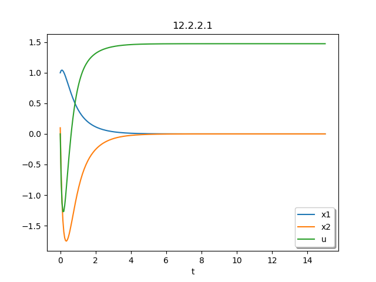

# Code/Plots
The problems were integrated using [`solve_ivp`](https://docs.scipy.org/doc/scipy/reference/generated/scipy.integrate.solve_ivp.html) from the `scipy` library in Python.

## 12.2.2.1)
```{.python include=p12-2-2-1.py}

```
\newpage

## 12.2.2.2)
```{.python include=p12-2-2-2.py}

```
\newpage

## 14.31)
```{.python include=p14-31.py}

```
\newpage

## 14.34)
```{.python include=p14-34.py}

```
\newpage

## 14.15 a)
```{.python include=p14-15-a.py}

```
\newpage

## 14.15 b)
```{.python include=p14-15-b.py}

```
\newpage

## Plotter
```{.python include=plot.py}

```
\newpage

## Script Runner
```{.shell include=run_plots.sh}

```
\newpage




# A note on `14-15-a` and `14-15-b`
Comparing the two plots, it can be noted that `a` has a better state response with more control applied. `b` converges slower, but has less overshoot with and less control applied.
